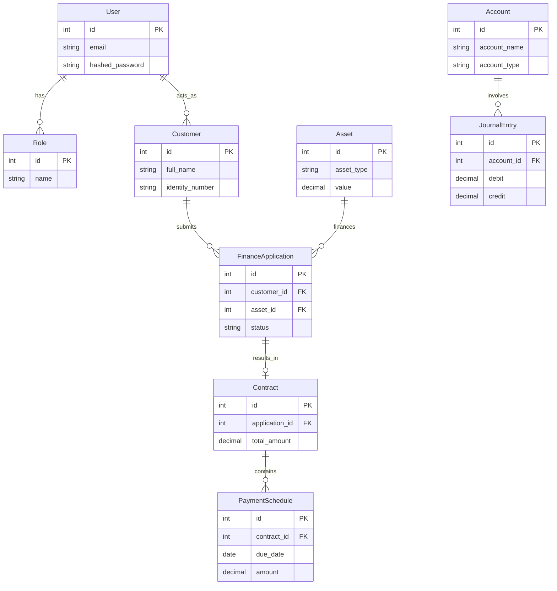

# Database Entity Relationship Diagram

The following Mermaid diagram illustrates the core entities and their relationships within the FinLease ERP database.

```mermaid
erDiagram
    User ||--o{ Role : has
    User ||--o{ Customer : acts_as
    User {
        int id PK
        string email
        string hashed_password
    }
    Role {
        int id PK
        string name
    }
    Customer ||--o{ FinanceApplication : submits
    Customer {
        int id PK
        string full_name
        string identity_number
    }
    Asset ||--o{ FinanceApplication : finances
    Asset {
        int id PK
        string asset_type
        decimal value
    }
    FinanceApplication ||--o| Contract : results_in
    FinanceApplication {
        int id PK
        int customer_id FK
        int asset_id FK
        string status
    }
    Contract ||--o{ PaymentSchedule : contains
    Contract {
        int id PK
        int application_id FK
        decimal total_amount
    }
    PaymentSchedule {
        int id PK
        int contract_id FK
        date due_date
        decimal amount
    }
    Account ||--o{ JournalEntry : involves
    Account {
        int id PK
        string account_name
        string account_type
    }
    JournalEntry {
        int id PK
        int account_id FK
        decimal debit
        decimal credit
    }
```
